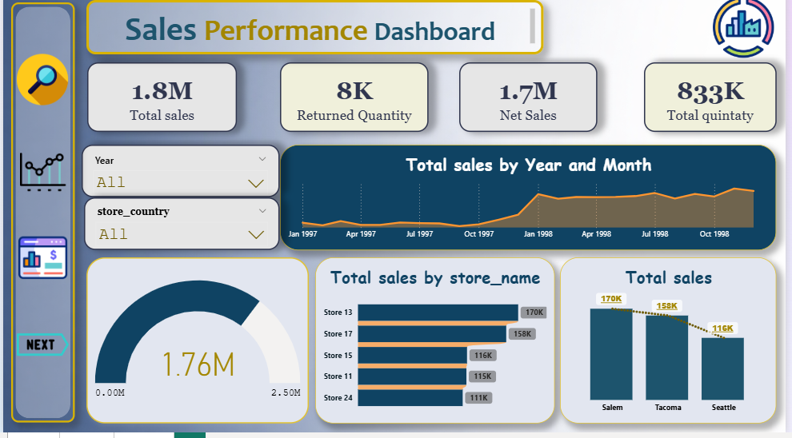
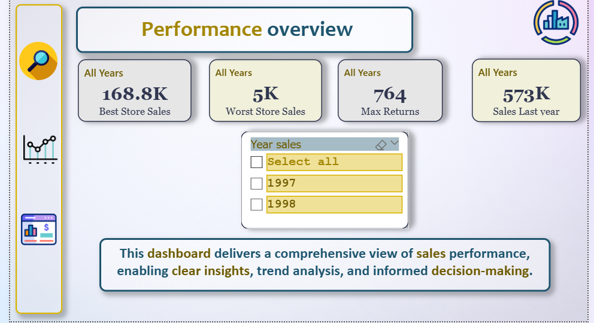

# Retail-Sales-Performance-Analysis-Power-BI-Dashboard
# 📊 Retail Sales Performance Analysis | Power BI Dashboard

Hi 👋
This project is a **Power BI dashboard** I built to explore and analyze retail sales performance across stores, products, and regions.

The goal of this project is to turn raw sales data into **clear insights** that help understand sales trends, store performance, and product returns.

---

# 🎯 Project Objectives

In this dashboard I wanted to answer a few important business questions:

* How are sales performing over time?
* Which stores generate the highest revenue?
* What is the total quantity sold?
* How many products are being returned?
* Which locations are performing better than others?

---

# 📈 Key Metrics

The dashboard tracks several important KPIs:

* **Total Sales:** 1.8M
* **Net Sales:** 1.7M
* **Returned Quantity:** 8K
* **Total Quantity Sold:** 833K

These KPIs provide a quick snapshot of overall business performance.

---

# 📊 Dashboard Pages

## 1️⃣ Sales Performance Dashboard

This page focuses on the **overall sales performance**.

It shows:

* Total Sales
* Net Sales after returns
* Total quantity sold
* Sales trends by **year and month**
* Store performance comparison
* Sales distribution by location

📷 Dashboard Preview

---

## 2️⃣ Performance Overview

This page highlights **high-level performance indicators**.

It includes:

* Best performing store
* Worst performing store
* Maximum product returns
* Sales from the last year

This page is designed to give a **quick executive summary** of business performance.

📷 Dashboard Preview

---

# 🧠 Key Insights

From this analysis we can quickly observe:

* **Store 13** is the top performing store with the highest sales.
* **Salem** appears to generate the highest revenue among cities.
* Sales show a noticeable increase from **1997 to 1998**.
* Product returns represent a relatively **small portion of total sales**, which indicates healthy product performance.

---

# 🗂 Data Model

The project uses a **Star Schema data model** to improve performance and simplify analysis.

Main tables used:

* Sales
* Customers
* Stores
* Products
* Returns
* Region
* Calendar

---

# 🛠 Tools & Skills Used

* Power BI
* Data Modeling
* DAX Measures
* Data Visualization
* Business Insight Analysis

